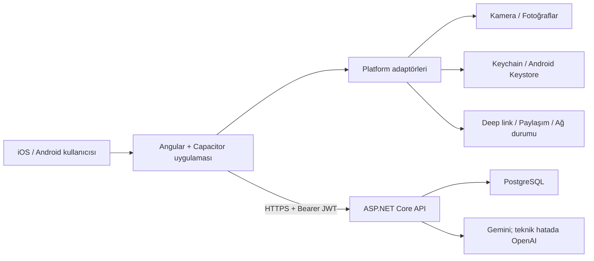

# PayDefteri Mobil Teknik Tasarım

**Durum:** Önerilen mimari  
**Tarih:** 8 Ağustos 2026  
**İlgili ürün dokümanı:** [MOBILE-PRD.md](./MOBILE-PRD.md)

**Teslim belgeleri:** [Mobil doküman indeksi](./mobile/README.md)  
**Mimari karar:** [ADR-003](./ADR-003-capacitor-mobile.md)

## 1. Mimari karar

Mobil uygulama, mevcut Angular 19 arayüzünü **Capacitor** ile iOS ve Android uygulaması olarak paketleyecektir. Ayrı bir Flutter veya React Native kod tabanı oluşturulmayacaktır. Böylece mevcut tasarım, responsive bileşenler, form kuralları, API modelleri ve fiş analizi akışı büyük ölçüde ortak kalır.

Ionic UI bileşenleri zorunlu değildir; mevcut PayDefteri bileşen ve stilleri korunur. Capacitor yalnızca uygulama yaşam döngüsü, kamera, deep link, bağlantı durumu ve güvenli cihaz özellikleri için native köprü sağlar.



## 2. Depo ve modül yapısı

Mevcut `src/web` ortak web/mobil Angular kaynağı olarak kalır:

```text
src/web/
├── src/app/
│   ├── core/
│   │   ├── auth/
│   │   └── platform/
│   │       ├── camera/
│   │       ├── connectivity/
│   │       ├── deep-link/
│   │       ├── session-store/
│   │       └── share/
│   ├── features/
│   └── shared/
├── android/                 # Capacitor tarafından yönetilen native proje
├── ios/                     # Capacitor tarafından yönetilen native proje
└── capacitor.config.ts
```

Her cihaz özelliği bir TypeScript arayüzüyle soyutlanır. Web adaptörleri tarayıcı API'lerini, mobil adaptörler Capacitor/native API'lerini kullanır. Feature bileşenleri doğrudan `window`, kamera veya secure storage çağırmaz.

Örnek sözleşmeler:

```ts
export interface CameraPort {
  captureOrSelect(): Promise<SelectedImage | null>;
}

export interface SessionStore {
  readRefreshToken(): Promise<string | null>;
  writeRefreshToken(token: string): Promise<void>;
  clear(): Promise<void>;
}
```

## 3. Uygulama yapılandırması

- Uygulama adı: `PayDefteri`
- App ID: `com.paydefteri.app`
- Mobil API: `https://paydefteri.com/api`
- Universal/App Link alan adı: `paydefteri.com`
- Mobil production build'de kaynak haritaları herkese açık yayınlanmaz.
- Gemini/OpenAI anahtarları yalnızca API sunucusunda tutulur; uygulama paketine hiçbir servis sırrı konmaz.

Önerilen script'ler:

```bash
npm run build:mobile --prefix src/web
npx --prefix src/web cap sync ios
npx --prefix src/web cap sync android
npx --prefix src/web cap open ios
npx --prefix src/web cap open android
```

`build:mobile`, Angular production çıktısını Capacitor `webDir` dizinine üretir. `ios/` ve `android/` projeleri repoda tutulur; otomatik üretilen build çıktıları tutulmaz.

## 4. Kimlik doğrulama ve oturum

Web istemcisinin HttpOnly cookie + XSRF akışı değişmez. Native WebView'da farklı origin ve cookie davranışlarına bağımlı kalmamak için mobil istemci Bearer access token kullanır.

### Token modeli

- Access token: JWT, 30 dakika; yalnızca uygulama belleğinde tutulur.
- Refresh token: kriptografik, opaque ve tek kullanımlık dönen token; 30 gün.
- Refresh token iOS Keychain veya Android Keystore destekli şifreli depoda saklanır.
- Sunucuda token'ın kendisi değil SHA-256 özeti tutulur.
- Her cihaz oturumu ayrı kayıttır; çıkışta ilgili oturum, parola değişiminde tüm oturumlar iptal edilir.
- Yenilenmiş bir token'ın tekrar kullanılması token ailesini iptal eder ve yeniden giriş ister.

Yeni API sözleşmesi:

```text
POST /api/mobile/v1/auth/login
POST /api/mobile/v1/auth/refresh
POST /api/mobile/v1/auth/logout
GET  /api/mobile/v1/auth/sessions
DELETE /api/mobile/v1/auth/sessions/{id}
```

Mevcut iş API'leri değiştirilmeden Bearer kimlik doğrulamasıyla kullanılır. Angular interceptor access token ekler, `401` halinde tek bir eşzamanlı refresh işlemi yürütür ve başarısız isteği en fazla bir kez tekrarlar. Multipart fiş yüklemelerinde de aynı mekanizma kullanılır.

Önerilen `MobileRefreshSession` alanları:

- `Id`, `UserId`, `TokenHash`, `FamilyId`
- `DeviceName`, `Platform`, `AppVersion`
- `CreatedAtUtc`, `ExpiresAtUtc`, `LastUsedAtUtc`
- `RevokedAtUtc`, `ReplacedBySessionId`

`TokenHash` benzersiz; `UserId + RevokedAtUtc` sorgusu indeksli olmalıdır. Login ve refresh uçları mevcut auth rate-limit politikasına dahil edilir.

## 5. API istemcisi ve ağ davranışı

- Tüm trafik TLS üzerinden production API'ye gider.
- İstemci `X-Client-Platform` ve `X-App-Version` başlıklarını gönderir.
- CORS yalnızca gerekli `capacitor://localhost` ve Android yerel origin'lerine izin verir; wildcard ve credential karışımı kullanılmaz.
- GET istekleri bağlantı düzeldiğinde kontrollü tekrar denenebilir.
- POST/PUT/DELETE istekleri yalnızca sunucuya ulaşmadığı kesin olan durumda tekrar edilir; çift kayıt riskine karşı oluşturma isteklerine istemci üretimli idempotency anahtarı eklenmesi önerilir.
- Uygulama minimum desteklenen sürüm bilgisini uzaktan alır; kritik güvenlik güncellemesinde zorunlu güncelleme ekranı gösterebilir.

## 6. Kamera ve fiş analizi

`CameraPort`, kullanıcıya kamera veya fotoğraf arşivi seçeneği sunar. İptal sonucu `null` döner ve mevcut gider formunun durumunu değiştirmez.

İşlem sırası:

1. Kamera/fotoğraf izni yalnızca kullanıcı aksiyonundan sonra istenir.
2. Görselin yönü düzeltilir; uzun kenar makul çözünürlüğe küçültülür.
3. JPEG/WebP olarak sıkıştırılır ve mevcut 8 MB sunucu sınırı istemcide de doğrulanır.
4. Görsel mevcut fiş analiz endpoint'ine multipart olarak gönderilir.
5. Sonuç forma taslak olarak uygulanır; kayıt için kullanıcı onayı gerekir.

Görsel cihaz önbelleğinde veya uygulama logunda kalıcılaştırılmaz. Sunucudaki Gemini → OpenAI fallback akışı değişmez. Sağlayıcı anahtarı ya da doğrudan AI çağrısı mobil uygulamada bulunmaz.

## 7. Deep link ve davetler

Tek kanonik bağlantı biçimi korunur:

```text
https://paydefteri.com/invite/{token}
```

- iOS için `apple-app-site-association`, Android için `assetlinks.json` yayınlanır.
- Uygulama yüklüyse `invite/:token` route'u açılır.
- Oturum yoksa token yalnızca işlem süresince güvenli geçici durumda tutulur; giriş/kayıttan sonra davete dönülür.
- Uygulama yüklü değilse mevcut web davet ekranı açılır.
- Token analitik, crash raporu veya uygulama loglarına yazılmaz.

## 8. Çevrimdışı çalışma ve önbellek

MVP online-first olacaktır. Son başarılı plan listesi, dashboard özeti ve gider listesi cihazda salt okunur önbelleğe alınabilir. Finansal çakışma ve mükerrer kayıt riski nedeniyle çevrimdışı yazma kuyruğu ilk sürümde bulunmaz.

- Bağlantı yokken önbellek zamanı ve `Çevrimdışısınız` bandı gösterilir.
- Ekleme, düzenleme, silme ve ödeme aksiyonları devre dışıdır.
- Kullanıcıya veri güncel olmayabilir uyarısı verilir.
- Önbellek kullanıcı hesabına göre ayrılır ve çıkışta silinir.
- Refresh token dışında hassas veri işletim sistemi yedeklerine dahil edilmez; finansal önbellek şifreli tutulur.

## 9. Mobil arayüz uyarlamaları

Mevcut component ve CSS tasarımı korunurken aşağıdaki teknik kurallar uygulanır:

- `env(safe-area-inset-*)` ile çentik ve home indicator alanları.
- En az 44×44 px dokunma hedefi ve erişilebilir form etiketleri.
- Android geri tuşunda önce modal/dropdown kapanır, sonra route geçmişine gidilir; ana ekranda ikinci geri basış uygulamadan çıkarır.
- Klavye açıldığında aktif alan görünür kalır; sabit aksiyonlar klavyenin altında kalmaz.
- Hover'a bağlı bilgi veya aksiyon bırakılmaz.
- Tablo içerikleri küçük ekranda mevcut mobil kart görünümünü kullanır.
- Kamera, fotoğraf ve dosya izin reddi durumunda ayarlara gitme açıklaması sunulur.

## 10. Native izinler ve mağaza gereksinimleri

İlk sürüm yalnızca gerekli izinleri ister:

- Kamera: fiş/fatura fotoğrafı çekmek için.
- Fotoğraflar: kullanıcının seçtiği fiş/fatura görselini almak için sınırlı erişim.
- Ağ: API erişimi için.

Konum, rehber, mikrofon ve arka plan çalışma izni istenmez. iOS Privacy Manifest, Android Data Safety formu, hesap/veri silme URL'si ve AI ile işlenen fiş verisine ilişkin gizlilik açıklaması yayın öncesi tamamlanır.

## 11. Gözlemlenebilirlik ve gizlilik

Mobil hata raporları sürüm, cihaz sınıfı, platform, route ve anonim hata kodu içerebilir. Aşağıdakiler kesinlikle kaydedilmez:

- JWT/refresh token, cookie ve davet token'ı.
- Fiş görseli veya AI sağlayıcı ham yanıtı.
- Gider tutarı, açıklaması, notu ve katılımcı kişisel bilgileri.
- Parola veya API anahtarı.

API tarafında mobil platform ve uygulama sürümüne göre başarı/hata metrikleri ayrıştırılır. Crash-free oran, login, refresh, gider oluşturma ve fiş analizi akışları için dashboard ve alarm eşikleri kurulur.

## 12. Test stratejisi

### Angular

- Web ve Capacitor platform adaptörü unit testleri.
- Access token ekleme, single-flight refresh, logout ve tekrar deneme testleri.
- Kamera iptalinde formun açık kalması ve analiz sonucunun taslak uygulanması.
- Deep link'in oturum öncesi/sonrası doğru route'a dönmesi.
- Peşin/taksitli gider ve paylaşım formu regresyon testleri.

### API

- Mobil login, refresh rotation, logout ve cihaz oturumu iptali entegrasyon testleri.
- Süresi dolmuş, iptal edilmiş ve yeniden kullanılan refresh token senaryoları.
- Rate limit, yetkisiz plan erişimi ve log redaksiyonu testleri.
- Bearer ile mevcut gider, ödeme, davet ve fiş endpoint regresyonları.

### Native ve uçtan uca

- XCUITest ve Espresso ile giriş, plan açma, manuel gider, kamera/galeri, davet linki ve çıkış smoke testleri.
- En az bir düşük/orta seviye Android cihaz ile küçük ve büyük ekranlı iPhone doğrulaması.
- Ağ kesilmesi, API timeout, uygulamanın arka plana alınması ve düşük bellek senaryoları.
- Gerçek cihazda izin reddi, tekrar izin verme ve deep link kurulumsuz fallback testi.

## 13. CI/CD ve imzalama

Mevcut .NET ve Angular kontrollerine mobil işler eklenir:

1. `npm ci`, lint/test ve Angular production build.
2. `npx cap sync` sonrasında iOS ve Android native proje doğrulaması.
3. Android debug build ve iOS simulator build.
4. Ana dalda imzalı TestFlight/Play Internal artefact üretimi.
5. Manuel onay sonrası mağaza kanalı terfisi.

Apple sertifikaları, provisioning profile, App Store Connect ve Google Play service account bilgileri CI secret deposunda tutulur. Repoya `.p12`, keystore, provisioning profile, parola veya API anahtarı eklenmez.

## 14. Uygulama fazları

### Faz 1 — Mobil temel

Capacitor kurulumu, platform adaptörleri, safe-area/klavye/geri tuşu, production environment ve cihaz build'leri.

### Faz 2 — Güvenli mobil oturum

Refresh session modeli ve migration, mobil auth endpoint'leri, secure storage ve Angular auth interceptor.

### Faz 3 — Native akışlar

Kamera/fotoğraf, fiş analizi, paylaşım ve universal/app link davet akışı.

### Faz 4 — Kalite ve beta

Salt-okunur önbellek, gözlemlenebilirlik, native E2E, erişilebilirlik, mağaza metinleri ve kapalı beta.

### Faz 5 — MVP sonrası

Push ödeme hatırlatmaları, isteğe bağlı biyometrik uygulama kilidi, tablet optimizasyonu ve güvenli çevrimdışı yazma modeli ayrı ürün kararları olarak ele alınır.

## 15. Tamamlanma ölçütü

- Web davranışında regresyon olmadan iOS ve Android production build alınması.
- PRD'deki MVP akışlarının gerçek cihazlarda geçmesi.
- Mobil token güvenlik ve yetkilendirme testlerinin yeşil olması.
- Fiş fotoğrafının kamera ve galeriden başarıyla analiz edilebilmesi.
- Davet linkinin uygulama yüklü/yüklü değil senaryolarında çalışması.
- Crash, finansal veri veya kimlik bilgisi sızıntısına yol açan kritik bulgu kalmaması.
- TestFlight ve Google Play kapalı test sürümlerinin incelemeye hazır olması.
