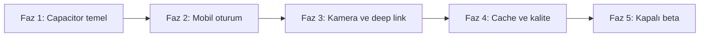

# Mobil Uygulama Uygulama Planı

## Amaç

Mevcut Angular web uygulamasını ve ASP.NET Core API'yi bozmadan, aynı kullanıcı hesabı ve verilerle çalışan iOS/Android uygulaması üretmek. Yaklaşım online-first, tek Angular kod tabanı ve ince platform adaptörleridir.

## Teslim stratejisi

Her faz ayrı, küçük PR'lara bölünür. Faz tamamlanmadan sonraki fazın bağımlı işleri merge edilmez. Branch adı `feature/mobile-<kısa-açıklama>`, commit biçimi `type(scope): açıklama` olmalıdır.

## Faz 0 — Hazırlık ve baz ölçüm

**Çıktı:** Geliştirme başlamadan doğrulanmış taban.

- Web production build, .NET build/test ve Docker build sonuçlarını kaydet.
- Mevcut mobil responsive ekranları gerçek iOS Safari ve Android Chrome'da smoke test et.
- Paket kimliğini `com.paydefteri.app`, minimum hedefleri iOS 16 ve Android API 29 olarak kesinleştir.
- Apple Developer ve Google Play hesap sahiplerini belirle; signing secret'larını repodan uzak tut.
- PRD, ADR ve bu plan için CTO/PM onayı al.

## Faz 1 — Angular + Capacitor temel

**Bağımlılık:** Faz 0  
**Çıktı:** Gerçek cihazda açılan, production API'ye bağlanabilen imzasız uygulama.

1. Capacitor core/CLI, iOS ve Android platform paketlerini ekle.
2. `capacitor.config.ts`, `environment.mobile.ts` ve `build:mobile` script'ini oluştur.
3. `ios/` ve `android/` native projelerini üret; build çıktıları ile secret dosyalarını `.gitignore` kapsamına al.
4. `core/platform` altında `PlatformPort`, `ConnectivityPort`, `CameraPort`, `DeepLinkPort`, `SharePort` ve `SessionStore` arayüzlerini oluştur.
5. Web ve Capacitor adaptörlerini dependency injection token'larıyla seç.
6. Safe-area, klavye, status bar, Android back button ve uygulama yaşam döngüsünü uygula.
7. Landing route yerine native açılışta oturum/plan yönlendirmesi yap; web route davranışını değiştirme.

**Kapı:** Angular web build, iOS simulator build, Android debug build ve mevcut web smoke testleri yeşil.

## Faz 2 — Güvenli mobil oturum

**Bağımlılık:** Faz 1  
**Çıktı:** Güvenli ve yenilenebilir native oturum.

1. `MobileRefreshSession` entity, EF configuration ve migration ekle.
2. `/api/mobile/v1/auth/login|refresh|logout|sessions` endpoint'lerini ekle.
3. Refresh token rotation, hash saklama, replay tespiti ve cihaz bazlı iptal uygula.
4. Access token'ı yalnız bellekte, refresh token'ı Keychain/Keystore destekli secure storage'da tut.
5. Angular mobil auth interceptor'a single-flight refresh ve en fazla bir retry ekle.
6. Web cookie/XSRF akışını regresyon testleriyle koru.
7. Parola değişiminde bütün mobil session ailelerini iptal et.

**Kapı:** Auth integration testleri, yetki sınırı ve token replay testleri yeşil; token loglarda görünmüyor.

## Faz 3 — Native kullanıcı akışları

**Bağımlılık:** Faz 2  
**Çıktı:** MVP'nin cihaz yeteneği isteyen akışları.

- Kamera/fotoğraf seçimi, izin reddi ve iptal davranışı.
- Görsel yön düzeltme, boyut kontrolü ve mevcut fiş analiz endpoint'ine multipart yükleme.
- `https://paydefteri.com/invite/{token}` Universal Link/App Link yapılandırması.
- Oturum öncesi gelen davetin giriş/kayıt sonrasında devam etmesi.
- Native share sheet ile davet/rapor paylaşımı.
- Uygulama arka plandan döndüğünde güvenli veri yenileme.

**Kapı:** Gerçek iOS/Android cihazda kamera, galeri, davet ve manuel gider E2E smoke testleri yeşil.

## Faz 4 — Çevrimdışı görünüm ve kalite

**Bağımlılık:** Faz 3  
**Çıktı:** Kesintilere dayanıklı, gözlemlenebilir beta adayı.

- Kullanıcıya ayrılmış, şifreli ve salt-okunur plan/dashboard/gider cache'i.
- Çevrimdışı bant, cache zamanı ve yazma aksiyonlarının kapatılması.
- Crash ve teknik olay telemetrisi; finansal değer, token ve fiş görseli redaksiyonu.
- Accessibility, düşük bağlantı, düşük bellek ve performans testleri.
- CI'a Android debug ve iOS simulator build işleri ekle.
- Uygulama sürümü/minimum sürüm kontrolü ile zorunlu güncelleme ekranı ekle.

**Kapı:** [Test Stratejisi](./TEST-STRATEGY.md) kalite kapıları ve [Güvenlik](./SECURITY-PRIVACY.md) stop-ship kontrolleri geçer.

## Faz 5 — Kapalı beta ve mağaza hazırlığı

**Bağımlılık:** Faz 4  
**Çıktı:** TestFlight ve Google Play kapalı test sürümü.

- App icon, splash, izin metinleri, gizlilik politikası ve veri silme URL'sini tamamla.
- İmzalı artefact üretimini CI secret'larıyla otomatikleştir.
- Internal testing → closed beta rollout uygula.
- Crash-free, login ve gider oluşturma metriklerini en az 7 gün izle.
- PM, QA, Security, CTO ve DevOps go/no-go kararını kaydet.

## PR ayrıştırması

| PR | Kapsam | Risk |
|---|---|---|
| 1 | Capacitor bağımlılıkları ve native iskelet | Orta |
| 2 | Platform portları, safe-area, back/keyboard | Orta |
| 3 | Refresh session backend ve migration | Yüksek |
| 4 | Mobil auth istemcisi ve secure storage | Yüksek |
| 5 | Kamera ve fiş analizi adaptörü | Orta |
| 6 | Universal/App Links ve davet devamı | Yüksek |
| 7 | Salt-okunur cache ve connectivity UX | Orta |
| 8 | Native CI, telemetry ve store metadata | Orta |

## Ana riskler

| Risk | Azaltım | Sahip |
|---|---|---|
| Web cookie auth regresyonu | Ayrı mobil endpoint ve web auth regresyon testi | Backend + QA |
| Token sızıntısı | Secure storage, log redaksiyonu, rotation/replay tespiti | Security + Backend |
| Native/WebView davranış farkı | Port/adaptör sınırı ve gerçek cihaz matrisi | Frontend + QA |
| Deep link token sızıntısı | Analytics/log redaksiyonu ve kısa yaşam döngülü geçici durum | Security |
| Çift gider oluşturma | UI kilidi ve sunucu idempotency anahtarı | Backend + Frontend |
| Mağaza reddi | İzin minimizasyonu, gizlilik ve hesap silme akışı | PM + DevOps |

